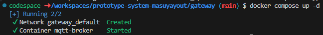
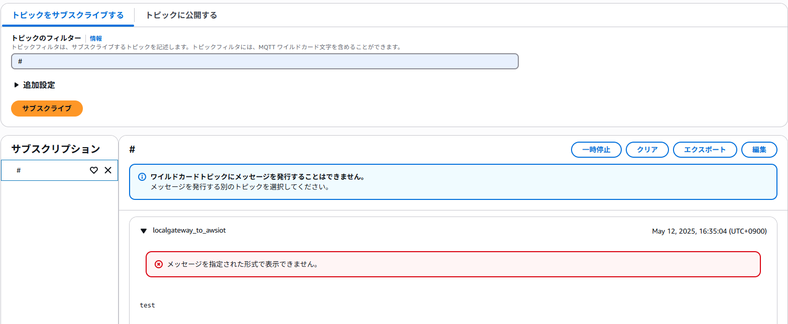

# IoTシステム工学レポート
## テップ1 ATOM Matrixの加速度センサを使い、Wi-Fiに接続する
### 目標
- エッジデバイス(ATOM Matrix)の開発環境の確認
  - arduino-cliを使ったATOM Matrix(ESP32)の開発
  - マイコンのコードをクラス設計して開発する
- ATOM Matrixの加速度センサを使う
### ビルド方法の確認

### [設計]テスト項目
1. Atom Matrixを動かして、加速度が変化するか確認する
2. 加速度をJSON形式で表示する
### [実装1]Atom Matrixの加速度センサを使う

### [テスト1] シリアルモニターでデバッグし、加速度センサが動作するか確認する
1. VS Codeに"Serial Monitor"を追加する
2. 「シリアルモニター」タブのポートをATOM Matrixが接続されているポートに指定し、ボーレートをentorypoint.cppで設定した「115200」に変更し、「監視の開始」をクリックする
3. シリアルコンソールに加速度が10秒ごとに表示される

### [実装2]加速度センサのデータをJSON形式に変換する
### [テスト2] 加速度がJSONで表示されるか確認する
- Atom Matrixを動かしたときに、加速度がJSONで表示される

## ステップ2 ATOM MatrixをWi-Fiに接続する
### 目標
- ATOM MatrixをWi-Fiでネットワークに接続し、疎通確認する
  - Wi-Fi APへの接続
  - pingによる疎通確認
### [設計]テスト項目
- Wi-Fi APへの接続を確認する
  - Wi-Fi APのMACアドレスが得られている
  - DHCPサーバからIPアドレスが振られる
- 疎通確認する
  - 同一セグメント内の別マシンにpingが通る
### [実装]ATOM MatrixをWi-Fiに繋いで実験室PCにpingを送る
### [テスト]テスト項目の確認
- Wi-Fi APのMACアドレスがシリアルコンソールに表示されるか？
- Wi-Fiに接続し、ATOM Matrixに割り振られたIPドレスが表示されるか?
- pingに対し、Successと表示されるか？

## ステップ2 MQTTブローカーを立ち上げる
### 目標
- MQTTブローカーを起動する
  - dockerを使ったサーバの起動、開発環境の整備
  - MQTTの動作確認
### [設計]テスト項目
- mqttサーバが起動し、ローカル環境でpublish、subscribeができる
### [設定] mosquittoのbrokerを立ち上げる(Dockerコンテナ)、brokerに対して、subscribe、publishして動作確認する

### [テスト] MQTT brokerの動作確認

### MQTT brokerの停止

### [確認] MQTT brokerのログを見る

## ステップ3 エッジデバイスからMQTTブローカーへデータを送る
### 目標
- ATOM MatrixでMQTTプロトコルによるデータの送信処理を実装する
### [設計]テスト項目
- MQTT brokerでsubscribeしているとき、ATOM Matrixを動かすとデータが受信される
### [実装] ATOM MatrixでMQTT publishするコードを追加する
### [テスト] brokerでデータが受信できるか確認

## ステップ4 AWS IoT Coreの準備
### 目標
- AWS IoT Coreの設定を行う
  - モノを登録する
  - 証明書によるデバイス管理
  - ポリシーを理解する
### [設定] AWS Academy Learner Lab
1. 「モジュール」をクリックする
2. 「AWS Academy Learner Labを起動する」をクリックする
3. 「Start Lab」をクリックする
4. 左の方にある「AWS」のところが緑の丸になってることを確認し、クリックする(緑ならLearner Labが起動している。黄は起動中。赤は停止。)
5. AWS Consoleにアクセスできる
### [Option] AWS CLI/Terraform
AWS CLIやTerraform等で扱う場合には「AWS Details」をクリックし、credentials情報を入手し、利用する
### [設定] AWS IoT Coreでデバイス登録(bridgeを登録、証明書、秘密鍵等をダウンロードする)
1. AWS IoT Coreを選択
2. 「管理」「すべてのデバイス」「モノ」を選択
3. 「モノを作成」を選択
4. 「１つのモノを作成」を選択
5. 「モノの名前」を入力(`iot_2025_Masuya`にしました)
6. 「新しい証明書を自動作成（推奨」を選択
7. 「ポリシーを作成」をクリック（新しいタブが開いてポリシーを設定する画面に写る）
8. 「ポリシー名」を入力（`iot_2025_Masuya_policy`にしました）
9. 「JSON」をクリックし以下のJSONを入力する。

## ステップ5 MQTT　ブローカーをMQTTブリッジとして機能させ、エッジデバイスからAWS IoT Coreへデータを送る
### 目標
- MQTT bridgeの役割について理解し、ATOM MatrixからのデータをAWS IoT Coreに送る
  - 証明書によるデバイス管理
  - bridgeするトピックの設定
### [設計]テスト項目
1. Gateway (MQTT broker)からMQTTでデータをpublishし、AWS IoT Coreでsubscribeできるか確認する
2. ATOM Matrixからデータをpublishし、AWS IoT Coreでsubscribeできるか確認する
### [設定] mosquittoのbrokerをAWS IoT Coreへのbridgeとして設定する
- IoT Coreへのbridgeとして設定するための設定ファイルmqtt-broker/bridge.confを作成し、以下の場所にファイルを配置する
### [テスト1] 　MQTTブローカーとAWS IoT Coreの疎通確認

### [テスト2] ATOM Matrixからデータを送る

## ステップ6 AWS IoT Coreで受信したデータをNodeREDで可視化する
### 目標
NodeREDで可視化する
- EC2のインスタンスにNodeREDをセットアップする
- NodeREDにダッシュボードノードを追加する
- NodeREDでコードを作成し、可視化する
### [設計]　テスト項目
- ATOM MatrixからのデータがNodeREDで可視化される
### [設定] EC2インスタンスにNode-REDをインストールする

### [設定] AWS IoT CoreにNodeREDのためのデバイスを追加登録する

### [実装] AWS IoT CoreからNodeREDにデータを送る(NodeREDでsubscribeする)

### [実装] NodeREDで可視化する

![[実装] NodeREDで加速度を全て可視化する](image-22.png)

### [テスト] Atom Matrix〜MQTT bridge〜AWS IoT Core〜Node-REDとデータが送信され、可視化できることを確認する

